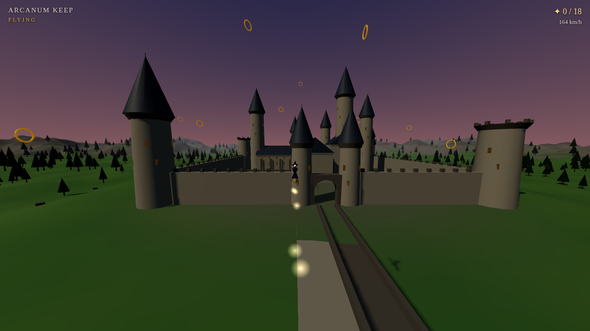
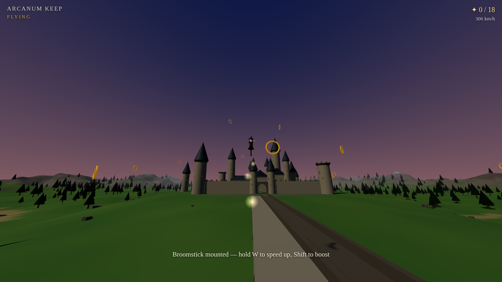

# Arcanum Keep — Broomstick Flight

A 3D browser game: freely explore a grand castle of magic on foot, then summon a
broomstick and take to the open sky. Every asset — terrain, castle, forest, sky,
character, sounds — is **procedurally generated in code**. No models, textures,
or audio files.



## Play

```
npm install
npm run build
```

Then serve the folder and open it in a browser:

```
python3 -m http.server 8000
# → http://localhost:8000
```

(Any static file server works. `npm run dev` gives you a watch + dev server.)

## Controls

| Input | On foot | On the broom |
|---|---|---|
| Mouse | look | steer (pitch & turn) |
| `W` `A` `S` `D` | walk | accelerate / brake / strafe |
| `F` | mount broom | dismount (near the ground) |
| `Shift` | sprint | **boost** |
| `Space` | jump | climb |

Goal: fly through all **18 golden rings** scattered over the valley.



## What's generated

- **Terrain** — Perlin-fBm heightfield with a castle plateau, lake basin,
  and a mountain ring at the horizon; vertex-coloured by altitude and slope.
- **Castle** — a generator assembles the great hall, keep, cloistered
  courtyard, curtain walls with battlements, spired towers, a gatehouse with a
  true arched opening, and a long arched viaduct — all merged into a handful
  of draw calls. Windows glow warmly as night falls.
- **Sky** — gradient dome shader with a full day/night cycle: sun, moon,
  stars, and keyframed dawn/dusk palettes driving fog and lighting.
- **Forest** — ~900 instanced firs placed by density, slope and altitude rules.
- **Character** — low-poly witch/wizard rider with a fluttering scarf, on a
  broom with bristles and foot pegs; banks into turns, sparkle trail behind.
- **Audio** — WebAudio-synthesized wind (filtered noise), ring chimes, and a
  mount whoosh.

## Tech

- [Three.js](https://threejs.org/) for rendering, bundled with esbuild into a
  single `dist/game.js` (no runtime CDN dependencies).
- Simple physics: gravity/jump on foot, velocity-chasing flight model with
  speed-scaled FOV, cylinder/box colliders for the masonry.

Original fan-inspired work — all names, geometry, and content are generated
and invented for this project.
